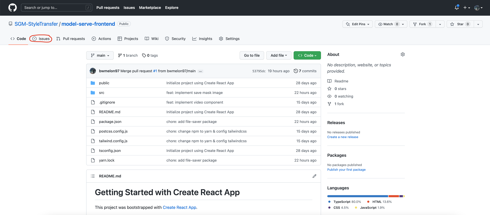
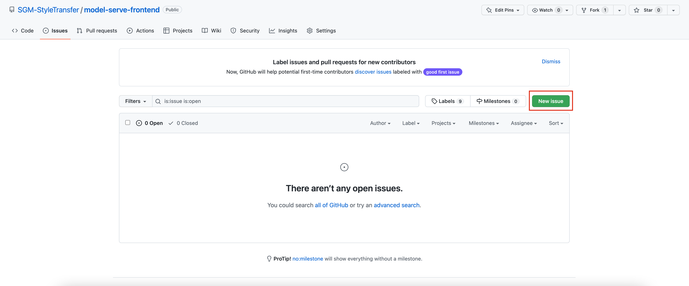
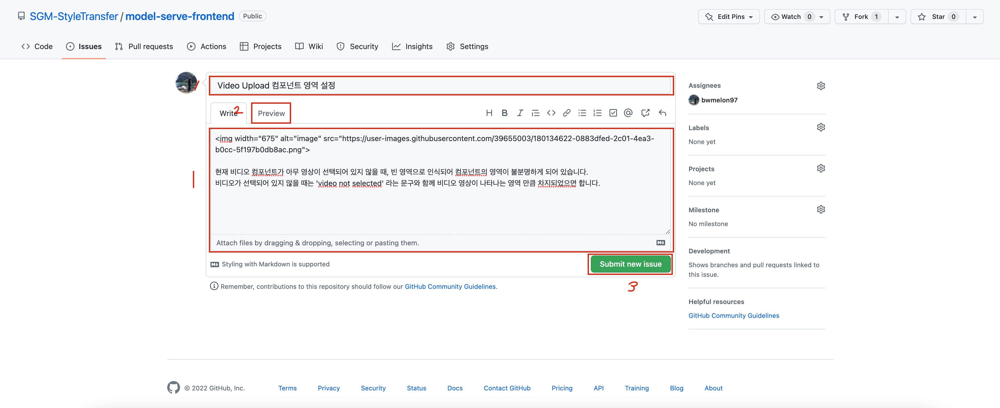

## Start Prototype

### 1. Download Project

git clone을 이용해서 프로젝트 코드를 다운 받습니다.

코드를 다운 받기 원하는 디렉토리로 이동한 뒤, terminal 혹은 git bash 등 CLI 툴을 이용해 아래 명령어를 입력합니다.

```bash
# 현재 디렉토리에 코드를 다운 받습니다.
git clone https://github.com/SGM-StyleTransfer/model-serve-frontend.git .	
```


### 2. Node 패키지 설치

Frontend 프로토타입은 `React.js` 프레임워크를 이용해 개발하였기 때문에, Javascript 기반의 패키지 모듈을 설치해야 합니다.

#### 2.1. JS 패키지 관리 툴(`npm` 또는 `yarn`)이 없는 경우

(`npm` 또는 `yarn` 이 설치되어 있는 경우, 2.2로 이동하면 됩니다.)

javascript와 node 기반의 프로젝트에서는 `npm`(Node Package Manager) 이 필요합니다. npm과 yarn은 같은 기능을 하기 때문에 npm만 설치해도 가능하며, yarn은 속도 및 편의성이 좋지만, npm 설치 이후에 추가로 설치해야 합니다.

저희 프로젝트는 yarn을 사용하여 제작했지만, 테스트할 때에는 npm도 가능합니다.

#### For Mac

1) Homebrew를 설치합니다. (Homebrew가 이미 있다면, 이 단계는 건너뛰어도 좋습니다.)

   ```bash
   /bin/bash -c "$(curl -fsSL https://raw.githubusercontent.com/Homebrew/install/HEAD/install.sh)"
   ```

   [Homebrew 홈페이지](https://brew.sh/index_ko)에 나와 있는 설치 방법입니다.

2) Node.js와 npm을 설치합니다.

   ```bash
   brew install node
   ```

   node를 설치하면, npm과 node.js가 함께 설치됩니다.

3) Node.js 와 npm이 잘 설치되었는 지 확인합니다.

   ```bash
   node -v
   npm -v
   ```

   각각의 명령문을 실행했을 때, 에러 없이 버전이 출력된다면 잘 설치가 된 것입니다.

4) [선택 사항] yarn 설치

   ```bash
   brew install yarn --ignore-dependencies
   ```

   npm과 마찬가지로 잘 설치되었는지 확인하고자 한다면, 버전 확인 명령어를 입력하면 됩니다.

   ```bash
   yarn -v
   ```

#### For Windows

윈도우 사용자는 이 [링크](https://hello-bryan.tistory.com/95)를 참고해주세요. 


#### 2.2. 프로젝트 패키지 다운로드

아래 명령어 중 하나를 선택하여 실행하면, 프로젝트를 실행하기 위해 필요한 패키지가 모두 설치됩니다. (두 줄을 모두 실행하면 오류가 생길 수 있습니다. 반드시 본인이 설치한 패키지 관리자에 맞는 한 가지 명령어만 실행해주세요)

```bash
npm install			# npm 사용자
yarn install		# yarn 사용자
```


### 3. 프론트앤드 프로토타입 실행

아래 명령어 중 본인이 사용하는 패키지 관리자에 해당하는 명령어를 입력하면, 프로토타입을 확인할 수 있는 dev server가 실행됩니다.

프로토타입은 `http://localhost:3000` 에서 확인할 수 있으며, 명령어를 입력하면 자동으로 브라우저를 통해 해당 링크로 접속합니다.

```bash
npm run				# npm 사용자
yarn run			# yarn 사용자
```


## How to Feedback

#### Github 이슈를 이용해서 피드백을 작성합니다.

Issue 페이지는 상단 탭에서 찾을 수 있으며 (아래 이미지의 빨간색 동그라미 부분) , 이 [링크](https://github.com/SGM-StyleTransfer/model-serve-frontend/issues) 통해서 들어올 수도 있습니다.



이슈 탭에서 New Issue 버튼을 클릭하면 새로운 이슈를 작성할 수 있습니다.



이슈 생성 페이지에서 다음과 같은 절차를 통해 피드백을 생성합니다.

1. 제목과 내용을 입력합니다.
2. Perview를 클릭하면 이슈를 생성하기 전에 미리보기를 확인 할 수 있습니다.
3. Submit New Issue 버튼을 클릭하면 새로운 이슈 (피드백) 작성이 완료됩니다.




## Repository Structure

